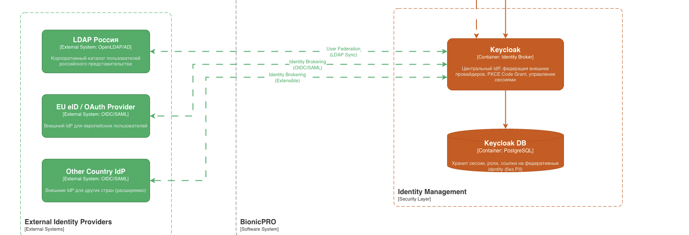
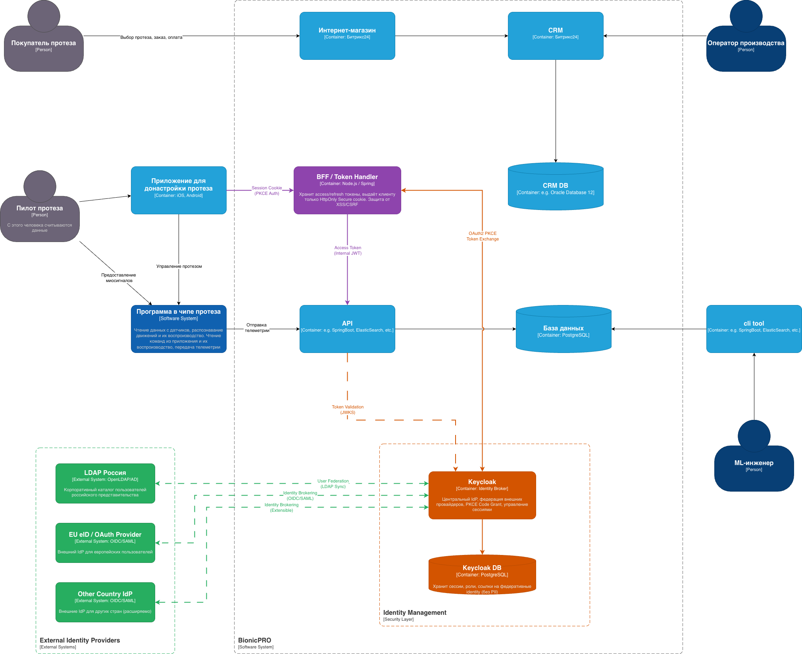

# Задание 1. Повышение безопасности системы BionicPRO

## Задача 1. Архитектурное решение для управления учётными данными пользователя

### Проблемы текущей архитектуры

1. **Public Client** - токены IdP передаются напрямую на фронтенд, что делает их уязвимыми к XSS-атакам
2. **Direct Access Grants** - использование Resource Owner Password Credentials flow, который считается небезопасным
3. **Отсутствие PKCE** - уязвимость к перехвату authorization code
4. **Локальное хранение учётных записей** - не поддерживает федерацию с внешними IdP разных стран

## Предложенное архитектурное решение

### 1. BFF - Backend for Frontend (token handler)

**Ключевой принцип**: фронтенд (мобильное приложение) никогда не получает и не хранит токены от IdP.

#### Преимущества:

- **Access и Refresh токены** хранятся в серверной сессии BFF
- Клиент получает только **HttpOnly Secure cookie** (session token)
- Защита от **XSS/CSRF** атак - токены недоступны из JavaScript
- Все запросы к API проходят через BFF, который добавляет реальный access token

### 2. PKCE Code Grant

Для мобильных приложений используется **Authorization Code Flow with PKCE**:

1. Клиент генерирует `code_verifier` (случайная строка)
2. Создаёт `code_challenge = SHA256(code_verifier)`
3. Отправляет `code_challenge` при запросе authorization code
4. При обмене code на токены отправляет `code_verifier`
5. IdP проверяет соответствие `code_challenge` и `code_verifier`

**Это защищает от перехвата authorization code.**

### 3. Федерация Identity Providers

Keycloak выступает как **Identity Broker** - центральная точка аутентификации:

#### User Federation (LDAP)

- Корпоративные пользователи из **LDAP/Active Directory** разных представительств
- Keycloak синхронизирует учётные записи без копирования паролей
- Аутентификация происходит напрямую против LDAP сервера

#### Identity Brokering (External IdP)

- Поддержка **OIDC/SAML** протоколов
- Подключение внешних IdP разных стран (Госуслуги, EU eID и т.д.)
- Keycloak хранит только **ссылки на внешние identity**, не копируя персональные данные

### 4. Локализация данных (Data Residency)

**Принцип**: персональные и медицинские данные хранятся локально в каждой стране.

| Компонент                  | Что хранит                                 | Где хранит                      |
| -------------------------- | ------------------------------------------ | ------------------------------- |
| **Keycloak DB**            | Сессии, роли, ссылки на federal identity   | Центральный сервер              |
| **External LDAP**          | Учётные записи корпоративных пользователей | В стране представительства      |
| **PostgreSQL (BionicPRO)** | Медицинские данные, телеметрия             | Локально в каждой стране        |
| **CRM DB**                 | Персональные данные клиентов               | По требованиям законодательства |

## Компоненты на C4 диаграмме

### Новые компоненты:

| Компонент                   | Тип             | Описание                                         |
| --------------------------- | --------------- | ------------------------------------------------ |
| **Keycloak**                | Container       | Центральный Identity Broker, PKCE Code Grant     |
| **BFF / Token Handler**     | Container       | Хранит токены, выдаёт session cookie             |
| **Keycloak DB**             | Container       | Хранит сессии, роли (без PII)                    |
| **LDAP Россия**             | External System | User Federation для российских пользователей     |
| **EU eID / OAuth Provider** | External System | Identity Brokering для европейских пользователей |
| **Other Country IdP**       | External System | Расширяемая поддержка других стран               |

## Соответствие требованиям

| Требование                             | Как обеспечивается                                                       |
| -------------------------------------- | ------------------------------------------------------------------------ |
| **Унификация доступа**                 | Keycloak как единая точка аутентификации с федерацией внешних источников |
| **Безопасная схема работы с токенами** | BFF Pattern - токены IdP не передаются на фронтенд                       |
| **Поддержка различных внешних IdP**    | Identity Brokering через Keycloak (OIDC/SAML)                            |
| **Локальное хранение PII**             | External LDAP/IdP в каждой стране, Keycloak хранит только ссылки         |
