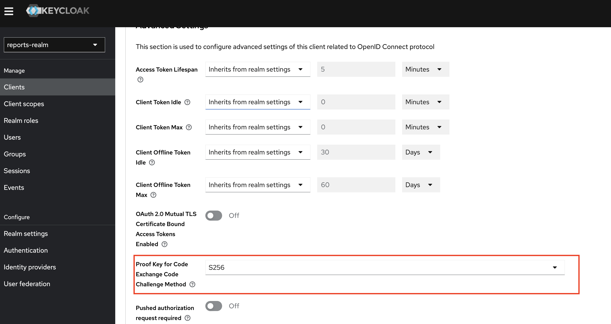

# Задача 2. Улучшение безопасности с помощью PKCE

## Проблема

Стандартный OAuth 2.0 Authorization Code Grant уязвим для атаки перехвата authorization code. Злоумышленник может перехватить код авторизации (например, через вредоносное ПО, history браузера или небезопасные redirect URI) и обменять его на access token.

Для публичных клиентов (SPA, мобильные приложения) эта проблема особенно актуальна, так как они не могут безопасно хранить client secret.

## Решение - PKCE (Proof Key for Code Exchange)

PKCE добавляет дополнительный уровень защиты:

1. Клиент генерирует случайную строку `code_verifier`
2. Вычисляет хеш SHA-256 - `code_challenge`
3. При запросе авторизации отправляет `code_challenge` на сервер
4. При обмене кода на токен отправляет оригинальный `code_verifier`
5. Сервер проверяет, что хеш `code_verifier` совпадает с ранее полученным `code_challenge`

Даже если злоумышленник перехватит authorization code, он не сможет обменять его на токен без знания `code_verifier`.

## Внесённые изменения

### 1. Keycloak

Добавлен атрибут для принудительного использования PKCE с методом S256:

```json
{
  "clientId": "reports-frontend",
  "attributes": {
    "pkce.code.challenge.method": "S256"
  }
}
```

### 2. Frontend (frontend/src/App.tsx)

Добавлена явная настройка PKCE при инициализации keycloak-js:

```typescript
const initOptions = {
  pkceMethod: "S256" as const
};

<ReactKeycloakProvider authClient={keycloak} initOptions={initOptions}>
```

## Запуск приложения

```bash
cd task1/subtask2
docker-compose up --build
```

Сервисы:

- Frontend: http://localhost:3000
- Keycloak: http://localhost:8080
- Keycloak Admin Console: http://localhost:8080/admin (admin / admin)

## Проверка работы PKCE

### Способ 1: Через DevTools браузера

1. Откройте http://localhost:3000
2. Откройте DevTools (F12) -> вкладка **Network**
3. При редиректе на Keycloak в URL будут видны параметры PKCE:

```
http://localhost:8080/realms/reports-realm/protocol/openid-connect/auth?
  client_id=reports-frontend
  &redirect_uri=http://localhost:3000/
  &response_type=code
  &code_challenge=<BASE64_HASH>
  &code_challenge_method=S256
```

4. После ввода логина/пароля в Network найдите POST-запрос на `/token` — в теле будет параметр `code_verifier`

### Способ 2: Через Keycloak Admin Console

1. Откройте http://localhost:8080/admin
2. Войдите: `admin` / `admin`
3. Выберите realm **reports-realm**
4. Перейдите в **Clients** -> **reports-frontend**-> **Advanced**
5. В разделе **Advanced Settings** должно быть **Proof Key for Code Exchange Code Challenge** - **S256**
   
