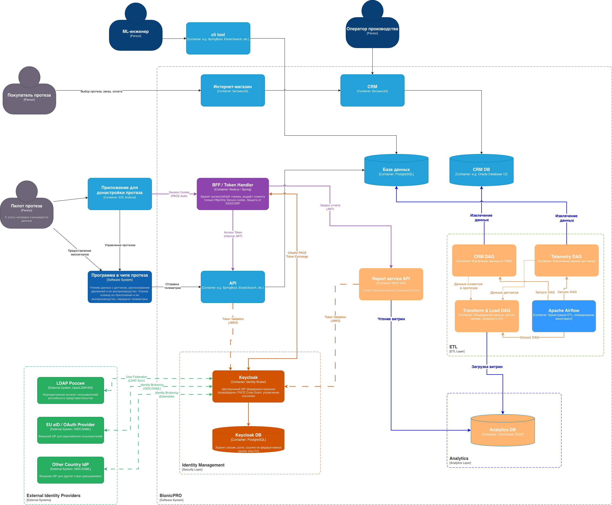

# Задание 2. Архитектура системы отчетов BionicPRO

## Задача 1. Архитектура решения для подготовки и получения отчетов

### Обзор решения

Для реализации функционала получения отчетов о работе протезов в существующую архитектуру BionicPRO добавлены новые компоненты, отвечающие за ETL-процесс и формирование отчетов.

## Добавленные компоненты

> **выделены оранжевым на диаграмме**

### 1. Report Service API

Отдельный микросервис, который предоставляет API для получения отчетов пользователями. Принимает запросы от BFF с JWT-токеном, валидирует права доступа через Keycloak и возвращает данные из аналитической базы.

**Связи:**

- Получает запросы от **BFF/Token Handler** (с JWT-токеном)
- Валидирует токены через **Keycloak** (JWKS)
- Читает витрины отчётности из **Analytics DB**

### 2. Apache Airflow

Платформа для оркестрации ETL-пайплайнов. Управляет запуском DAG (Directed Acyclic Graph) по расписанию, обеспечивает мониторинг выполнения задач, автоматические retry при сбоях и alerting.

**Связи:**

- Запускает **CRM DAG**, **Telemetry DAG**, **Transform & Load DAG**

### 3. CRM DAG

DAG для извлечения данных о клиентах и протезах из CRM-системы. Получает информацию о пользователях, их протезах, серийных номерах и истории обслуживания.

**Связи:**

- Запускается **Apache Airflow**
- Извлекает данные из **CRM DB**
- Передаёт данные в **Transform & Load DAG**

### 4. Telemetry DAG

DAG для извлечения телеметрии с датчиков протезов из оперативной базы PostgreSQL. Получает данные о миосигналах, движениях, времени отклика, состоянии батареи.

**Связи:**

- Запускается **Apache Airflow**
- Извлекает данные из **База данных (PostgreSQL)**
- Передаёт данные в **Transform & Load DAG**

### 5. Transform & Load DAG

DAG для трансформации и загрузки данных. Объединяет данные телеметрии с данными CRM по идентификатору протеза, рассчитывает агрегированные метрики и загружает готовые витрины в аналитическую базу.

**Основные трансформации:**

- JOIN телеметрии и данных CRM по `protez_id`
- Расчёт агрегированных метрик (среднее время отклика, количество движений, уровень заряда)
- Партиционирование по дате

**Связи:**

- Запускается **Apache Airflow** (после завершения CRM DAG и Telemetry DAG)
- Получает данные от **CRM DAG** и **Telemetry DAG**
- Загружает витрины в **Analytics DB**

### 6. Analytics DB (ClickHouse OLAP)

Колоночная OLAP-база данных для хранения агрегированных витрин отчётности. Оптимизирована для быстрых аналитических запросов и агрегаций на больших объёмах данных.

**Преимущества ClickHouse:**

- Колоночное хранение - оптимально для аналитики
- Высокая производительность агрегаций
- Эффективное сжатие данных телеметрии
- Партиционирование по дате для оптимизации запросов

**Связи:**

- Получает данные от **Transform & Load DAG**
- Предоставляет данные для **Report Service API**

## Обеспечение требований безопасности

| Требование                            | Реализация                                                       |
| ------------------------------------- | ---------------------------------------------------------------- |
| Пользователь видит только свои данные | Report Service API проверяет `user_id` из JWT при каждом запросе |
| Защита токенов                        | BFF Pattern — токены IdP не передаются на фронтенд               |
| Аутентификация                        | OAuth2 PKCE через Keycloak                                       |
| Авторизация                           | Валидация JWT через JWKS endpoint Keycloak                       |
