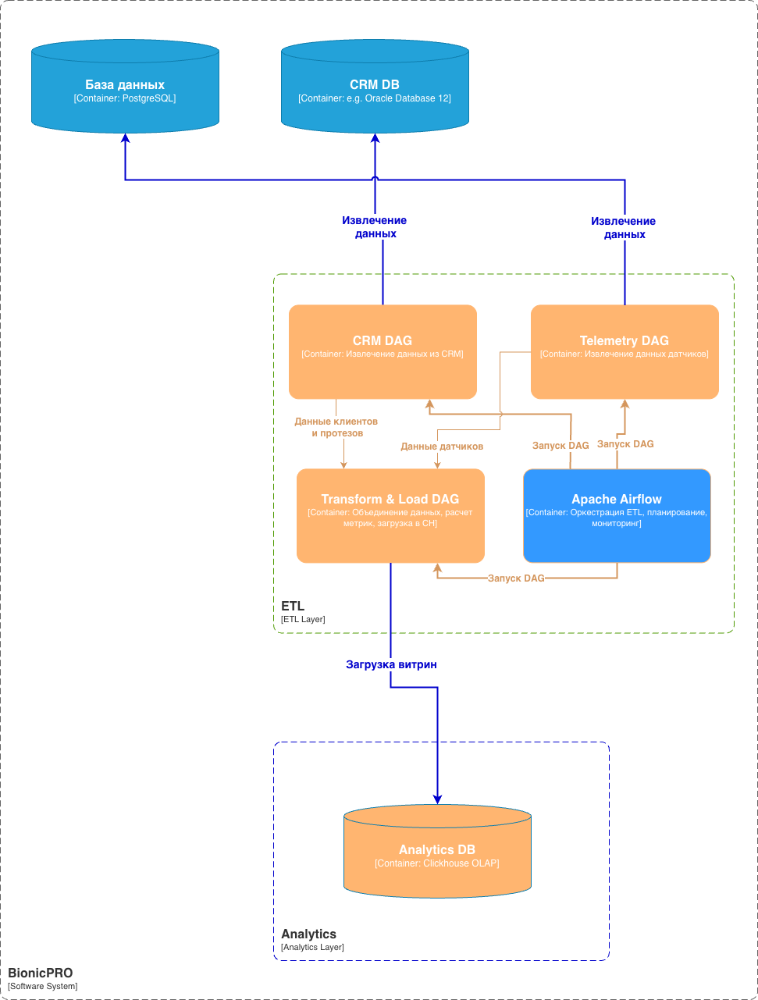
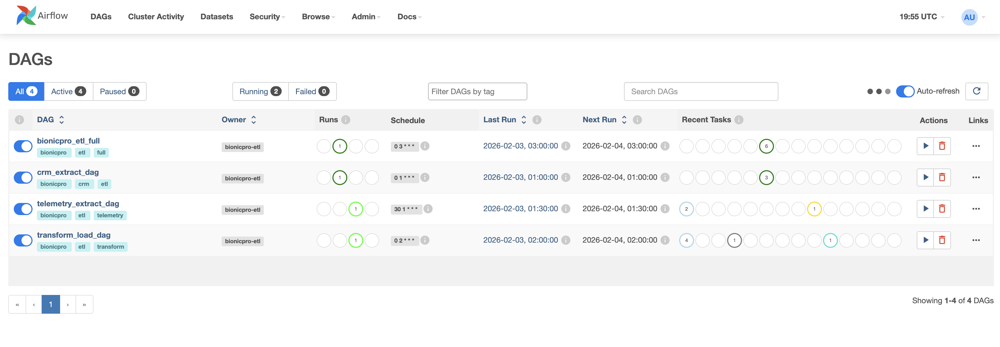

# Задание 2. Архитектура системы отчетов BionicPRO

## Задача 2. ETL-процесс BionicPRO

## Описание

ETL-система для извлечения данных из CRM-системы и основной базы телеметрии, их трансформации и загрузки в аналитическое хранилище ClickHouse для формирования отчётов.

## Архитектура



## DAG (Directed Acyclic Graphs)



### CRM Extract DAG (`crm_extract_dag`)

**Расписание:** ежедневно в 01:00 UTC

Извлекает данные о клиентах и их протезах из CRM-системы:

- Информация о клиентах (ФИО, контакты, город)
- Связи клиент-протез (серийный номер, дата покупки)
- Информация о гарантии и сервисе

### Telemetry Extract DAG (`telemetry_extract_dag`)

**Расписание:** ежедневно в 01:30 UTC

Извлекает телеметрию с датчиков протезов:

- Уровень заряда батареи
- Время отклика
- Сила захвата
- Амплитуда миосигналов
- Количество движений
- Температура
- Коды ошибок

### Transform & Load DAG (`transform_load_dag`)

**Расписание:** ежедневно в 02:00 UTC (после CRM и Telemetry DAG)

Выполняет трансформации:

- JOIN телеметрии и данных CRM по `prosthesis_serial_number`
- Расчёт агрегированных метрик
- Загрузка в витрины

### Full ETL DAG (`bionicpro_etl_full`)

**Расписание:** ежедневно в 03:00 UTC (альтернативный полный прогон)

Объединяет все этапы в один пайплайн. Можно использовать для:

- Ручного запуска полного ETL
- Первоначальной загрузки исторических данных

## Витрины данных

### dm_client_telemetry_daily

Ежедневная агрегация телеметрии в разрезе клиентов:

| Поле                     | Описание                  |
| ------------------------ | ------------------------- |
| report_date              | Дата отчёта               |
| client_id                | ID клиента                |
| client_name              | ФИО клиента               |
| prosthesis_serial_number | Серийный номер протеза    |
| avg_battery_level        | Средний уровень заряда    |
| avg_response_time_ms     | Среднее время отклика     |
| total_movements_count    | Общее количество движений |
| error_count              | Количество ошибок         |

### dm_client_summary

Сводная статистика по клиентам:

| Поле                | Описание                           |
| ------------------- | ---------------------------------- |
| client_id           | ID клиента                         |
| client_name         | ФИО клиента                        |
| total_prostheses    | Количество протезов                |
| avg_daily_movements | Среднее количество движений в день |
| avg_battery_level   | Средний уровень заряда за 30 дней  |
| total_errors_30d    | Ошибки за последние 30 дней        |
| last_activity_date  | Дата последней активности          |

## Запуск

### Запуск сервисов

```bash
cd task2/subtask2
docker-compose up -d
```

### Доступ к интерфейсам

- **Airflow UI:** http://localhost:8080 (admin/admin)
- **ClickHouse:** http://localhost:8124

### Проверка результатов

Подключитесь к ClickHouse и выполните запросы:

```bash
docker exec -it bionicpro-clickhouse clickhouse-client
```

```sql
-- Проверка витрины по клиентам
SELECT * FROM analytics.dm_client_summary LIMIT 10;

-- Проверка ежедневной витрины
SELECT
    report_date,
    client_name,
    prosthesis_serial_number,
    avg_battery_level,
    total_movements_count,
    error_count
FROM analytics.dm_client_telemetry_daily
ORDER BY report_date DESC
LIMIT 20;

-- Агрегация по клиентам за период
SELECT
    client_name,
    sum(total_movements_count) as total_movements,
    avg(avg_battery_level) as avg_battery,
    sum(error_count) as total_errors
FROM analytics.dm_client_telemetry_daily
WHERE report_date >= today() - 7
GROUP BY client_name
ORDER BY total_movements DESC;
```

## Остановка

```bash
docker-compose down
```

Для полной очистки (включая данные):

```bash
docker-compose down -v
```

## Тестовые данные

При первом запуске автоматически создаются:

**CRM База:**

- 10 клиентов
- 10 протезов (по одному на клиента)
- История обслуживания

**Основная База (телеметрия):**

- 10 протезов разных моделей
- ~3900 записей телеметрии (30 дней × 10 протезов × 13 записей/день)
